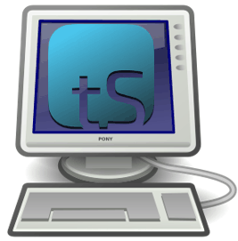

tS for Desktop: Performing Navigation 
========================================

    
Layout
------

There are two main screens in the translationStudio program: 

*	The Home screen, or *Your Translation Projects* screen, shows any projects that have been created on the tablet. If there are no projects, the Home screen displays a welcome message. The Home screen also shows the user name and a Log out button.

*	The *Project* screen shows the source and target texts, and can also display translation resources. The Project screen is where you perform all of the translation work on a single project. It shows the source text and the translated text. Depending on the type of project, the Project screen can display three different views and contains navigation and menu icons to enable you to move around in the program. The navigation and menu icons are on the left of the screen.

The appearance of the project screen and the function of the navigation buttons work a little differently depending on the type of project in which you are working:

Working in a Words project:
^^^^^^^^^^^^^^^^^^^^^^^^^^^

A Words project is different from the other project types in that it is not tied to a specific book of the Bible. It shows words or terms from the entire Bible or Open Bible Stories.

**Words project layout**

A Words project has two panes. The left pane contains the English word or term and the definition of it. The right pane is the working area containing a notecard for each word. You translate the word or term above the red line and the definition in the area below the red line. Just click the notecard to begin typing your translation.
 
*	Translate the translationWord in the top section on the right panel. 
  *	Click above the red line on the 'Translate word here' words. 
  *	Type in the translation of the word or phrase. 
*	Translate the definition of the translationWord: Click on the words 'Translate definition here' and start typing the translation of the definition. Write translations that will help Other Language translators understand how they can determine the best word to use in their language. 

**Words project navigation**

You navigate in a Words project by using the navigation icons at the left:
 

Working in a Notes project
^^^^^^^^^^^^^^^^^^^^^^^^^^

The translationNotes are tied to a specific part, or chunk, of Open Bible Stories or of a book of the Bible.

**Notes project layout**

A Notes project is divided into chunks of text. For each chunk there are four panes. From left to right, they are:
 
*	The source text pane: If you have multiple source texts, they are displayed on tabs.

*	The translation pane: If the project contains a translation in the target language, it is shown here, but cannot be edited.

*	The working area, where you can create notecards for translating the notes.

*	The resources pane, containing the resources, if any, for each chunk. Different resources are on the tabs. 

To translate notes, you click the Notes tab and then click each note reference to see the note text. 
       
Then for each note in the chunk you click the plus sign in the work area to create a notecard, where you translate the note reference text above the red line and the note text below the red line. For each chunk, create a notecard and translation for each note in the chunk.
 
**Notes project navigation**

To navigate in a Notes project, use the navigation buttons at the left of the screen:
 
Working in a Questions project
^^^^^^^^^^^^^^^^^^^^^^^^^^^^^^

The translationQuestions, like the translationNotes, are tied to a specific part, or chunk, of Open Bible Stories or of a book of the Bible.

**Questions project layout**

A Questions project has the same four panes as a Notes project, except that the Working pane (2nd from the right) enables you to translate Questions, rather than Notes. 
 

To translate the questions:
1.	You first click the Questions tab in the Resources pane at the far right to see the questions. 
2.	You click each question to see the question and answer. 
3.	Then in the Working pane you click the plus sign to add a notecard for the question. 
4.	You translate the question above the red line and the answer below the red line. 
5.	For each chunk that has questions, create a notecard for each question and translate each question.
       

**Questions project navigation**

Navigation in a Questions project is the same as for a Notes project.

Working in a Text project
^^^^^^^^^^^^^^^^^^^^^^^^^

The appearance and function of the text project can be different depending on the setting called Blind Edit Mode. This mode, which applies only to text projects, specifies whether the project allows for blind drafting, which changes the views available for the project. You should always use Blind Edit Mode for the initial translation of source text.

**Text project layout**

If you are not in blind edit mode, there are two views for a text project:

*	*Edit-Review view*: The top icon at the left that looks like three vertical lines takes you to the Edit-Review view, where the source text is in the left pane, the translated text is in the middle pane, and the resources are on tabs in the right pane. The center pane can be edited.  

*	*Read view*: The second icon at the left that looks like 3½ horizontal lines takes you to the Read view, which is a view of the entire chapter. The source text is initially visible, but if you click the “piece of paper behind the source text, you can see the translation. Editing is not available in the Chapter view.
 

**Blind Edit Mode**

To use Blind Edit Mode, see *How do I set up to translate the Bible or Open Bible Stories?* in `translationStudio for the Desktop <ts-info.readthedocs.io/en/latest/desktop.rst>`_

If you change the settings to Blind Edit Mode, a third view is available for text projects. You access this Blind Edit view by clicking the icon that looks like two sheets of paper. 

This *Blind Edit view* shows you the source text one chunk at a time, and you click the card behind the source text to translate. You cannot see the source and the translation at the same time, so it enforces a blind draft. This is the view you should use if you are doing a translation of Bible or Open Bible Stories text.
 
For additional information on translating in a text project, see Translate in a Text Project.

**Text project navigation**

The navigation buttons in a text project are different depending on the view:
*	In the Blind Edit view or the Edit-Review view, the navigation buttons are the same as in the Notes or Questions projects.
*	In the Read view, the buttons are similar except that there are no “previous chunk” or “next chunk” buttons, since the Read view is not divided into chunks.

Slider
------

The Slider icon is a quick way to move through a story or book of the Bible. 

* Tap-and-hold the dot and drag it towards the bottom (right) or the top (left) of the slider. 

* Numbers may appear on the line that represent the chapter of the book at that location of the slider.
   
Resources
---------

**Note**: Currently the resources are attached to the English ULB, so they are available in translationStudio only when the English ULB is used as the souce text.

All of the translationNotes, translationWords and translationQuestions are included in the translationStudio program. The resources are found in the far right pane of the Edit-Review view. To access that view, click the Edit-Review icon that looks like three vertical lines.

The Resources pane is divided into four tabs: Notes, Words, Questions, and UDB. The UDB tab simply contains the UDB (Unlocked Dynamic Bible) text for the chunk.

If there are no existing resources for a particular chunk, the resources pane is blank. If there are no resources of one of the types, then that tab does not exist on the resources pane. For example, if there are no Words for a chunk, then you would see only the Notes and Questions tabs on the Resources pane for that chunk.

translationNotes
^^^^^^^^^^^^^^^^

Click the Notes tab for the translationNotes.
  
The words or phrases are listed as they appear in the story or in the ULB. Click the phrase for help in understanding how to translate into the target language. See Using the translationNotes for more information.

translationWords
^^^^^^^^^^^^^^^^

Click the Words tab for the translationWords. 
  
The words are listed as they appear in the story on in the ULB. Click the word or phrase for help in understanding how to translate the word into the target language.

translationQuestions
^^^^^^^^^^^^^^^^^^^^

Click the Questions tab for the translationQuestions. 
 
The questions are about information as it appears in the story on in the ULB. Read the question and answer it according to the translated text. Click the question for the expected answer. If the given answer and the expected answer are the same then the translation might be clear and accurate.
 
Options Menu 
------------

Tap the three dots icon at the bottom left (or right) of the screen to open the options menu. The Project screen and the *Your Translation Projects* screen (home screen) have two different menus.

* On the *Your Translation Projects* screen the options menu includes the following options: 

  * **Update**: Update source or target language files or the translationStudio app
   
  * **Import**: Import a project or source text
   
  * **Feedback**: Report a bug 
   
  * **Share this app**: Share with another tablet
   
  * **Log Out**: Log out of the app so you can log in as a different user
   
  * **Settings**: Adjust translationStudio settings; view license agreement, statement of faith, or translation guidelines  (See `Settings <ts-info.readthedocs.io/en/latest/tSettings.rst>`_)

* On the Project screen the options menu includes: 

  * **Home**: returns to the Your Translation Projects screen (home screen)
  
  * **Project Review**: Check completion status of project, add contributors, upload or export your work
  
  * **Upload/Export**: Back up or share your work
  
  * **Print**: Print out your work
  
  * **Feedback**: Same as on home screen 
  
  * **Settings**: Same as on home screen 
  

