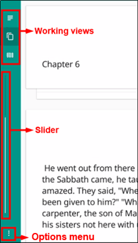

tS for Android™: Performing Navigation 
========================================

.. image:: ../images/tSForAndroidWithAttr.gif
    :width: 305px
    :align: center
    :height: 245px
    :alt: translationStudio for Android
    
Layout
------

There are two screens in the translationStudio app: 

*	The Home screen, or Your Translation Projects screen, shows any projects that have been created on the tablet. If there are no projects, the Home screen displays a welcome message. The Home screen also shows the user name and a Log out button.

*	The Project screen shows the source and target texts, and can also display translationHelps.

The Project screen is where you perform all of the translation work on a single project. It shows the source text and the translated text. The Project screen can display three different views of these and contains navigation and menu icons to enable you to move around in the program. 
The navigation and menu icons are on the left of the screen if you hold the tablet or phone in a horizontal position, and at the bottom of the screen if you hold the device in a vertical (tall) position.  It is best to hold the tablet or phone in a horizontal position.

In the horizontal position:

* The top three icons are the working views.

* The slider in the middle moves through the text.

* The options menu is the three dots icon at the bottom.

Working Views Icons
-------------------

The project screen can display three different views of the texts that you can access by tapping the working view icons:

* The **Chapter or Story icon** is the top working views icon on the left (held horizontally) or bottom left (held vertically) and looks like 3½ horizontal lines. This shows the texts divided by chapters.

   * Swipe up to read the entire chapter or story in the source text language. 

   * Swipe to either side, or tap the page behind the text, for a page to view the target language translation of the text. 
 
* The **Chunk icon** is the middle working views icon on the left (held horizontally) or bottom (held vertically) and looks like two pages, one behind the other. This shows the text divided into chunks, or small sections of the story or chapter. 

   * Swipe down or up to move from chunk to chunk. 
   
   * Swipe to the side, or tap the page behind the chunk, for a note card to type in, view, or edit the target language translation of the text.
 
* The **Check icon** is the last working views icon on the left (held horizontally) or bottom (held vertically) and looks like three vertical lines. In this view, while the texts are divided by chunks as in the chunk view, the source text is on the left and the translation work is on the right so that you can compare them side-by-side. You also have Bible resources (translationNotes, translationWords, and translationQuestions) available in this view.

   * Click the pencil icon to edit the text
   
   * Swipe up or down to move from chunk to chunk. 
   
   * Swipe from the right to the left side, or tap in the right margin, to show the resources for that chunk.
   
Resources
^^^^^^^^^

When you are in the *Check view*, you have Bible resources available to you to assist in checking and refining the draft. Swipe from the right to the left side, or tap in the right margin, to show the resources for that chunk.

The Resources pane is divided into three tabs. All of the translationNotes, translationWords, and translationQuestions are included in translationStudio. 

* Tap either Notes, Words, or Questions to navigate among the tabs. 
    
    * For **Notes** or **Words**, the words or phrases are listed as they appear in the story or in the ULB. Tap the word or phrase for help in understanding how to translate into the target language. 
    
    * **Questions**: The questions are about information as it appears in the story on in the ULB. Read the question and answer it according to the translated text. Tap the question for the expected answer. If the given answer and the expected answer are the same then the translation might be clear and accurate.

* If there are no existing resources for a particular chunk, the resources pane is blank. 

* If there are no resources of one of the types (such as Words), then that tab does not exist on the resources pane (you would see only the Notes and Questions tabs).

Slider
------

The Slider icon is a quick way to move through a story or book of the Bible. 

* Tap-and-hold the dot and drag it towards the bottom (right) or the top (left) of the slider. 

* Numbers may appear on the line that represent the chapter of the book at that location of the slider.
 
Options Menu 
------------

Tap the three dots icon at the bottom left (or right) of the screen to open the options menu. The Project screen and the *Your Translation Projects* screen (home screen) have two different menus.

* On the *Your Translation Projects* screen the options menu includes the following options: 

  * **Update**: Update source or target language files or the translationStudio app
   
  * **Import**: Import a project or source text
   
  * **Feedback**: Report a bug 
   
  * **Share this app**: Share with another tablet
   
  * **Log Out**: Log out of the app so you can log in as a different user
   
  * **Settings**: Adjust translationStudio settings; view license agreement, statement of faith, or translation guidelines  (See rst_tutorial_)

* On the Project screen the options menu includes: 

  * **Home**: returns to the Your Translation Projects screen (home screen)
  
  * **Project Review**: Check completion status of project, add contributors, upload or export your work
  
  * **Upload/Export**: Back up or share your work
  
  * **Print**: Print out your work
  
  * **Feedback**: Same as on home screen 
  
  * **Settings**: Same as on home screen 
  

