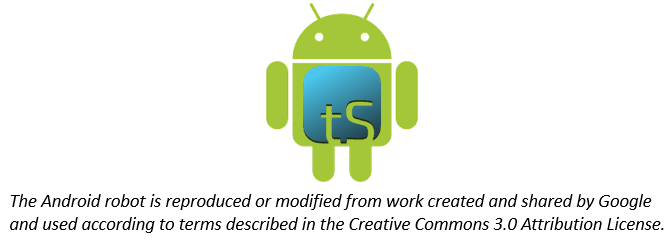

translationStudio for Android™: Getting Started
===============================================

The app translationStudio for Android is a mobile app that enables offline translating. It contains the content that needs to be translated as well as translationHelps. You can share information directly from device to device, and you can upload finished content to Door43 where it can be digitally published.

Installation
------------
1.	Tap the Google Play Store icon on the Android device. Google Play Store opens.
 
2.	In the search bar at the top of the screen, type **translationStudio** with no spaces and tap the magnifying glass on the keyboard.
 
3.	When the Play Store has found the program, tap the tS icon.
 
4.	Tap **Install**. The program downloads and then installs.
 
5.	Once the program is installed, tap **Open**.

6.	Tap **ALLOW** to enable translationStudio to access photos, media, and files on your device.
 
There may be an automatic update before the translationStudio app opens.

Login Options
-------------

When translationStudio first opens, you are presented with a request to create or log in to an account. 
There are two types of accounts that you can use:

* **Offline Account** – user has full use of the program except for uploading to Door43. You may want to start with an offline account and then switch to a Door43 account later when you want to upload your work (the work is attached to the device, not to the account).  

* **Door43 Account** – user has full use of the program and can upload to Door43 (requires Internet connection.)

If you do not want to create a new Door43 account at this time or are not able to connect to the Internet, you can create an offline account:

1.	On the opening screen, tap **Create offline Account**. The login screen opens.

2.	Tap the **Your Name or Pseudonym** field.  

3.	Type your user name or pseudonym into the field, and then tap **Continue**. (You may use a pseudonym instead of your real name. A pseudonym is a name that cannot be traced back to you.)

4.	Tap **Continue** to acknowledge the privacy notice.

If you are connected to the internet want to use an existing Door43 account, you can tap **Login with Door43 account**. Enter your Door43 credentials to log in.

If you do not have a Door43 account, but you wish to be able to use an Internet connection to upload your work to Door43, you can create a Door43 account:

1.	Tap **Create new Door43 Account** to create a new Door43 user account. The Door43 Account Creation window opens. (This requires an Internet connection.)

2.	Tap the **Your Name or Pseudonym** field and type your name or pseudonym into the field. This is the display name -- the name that will be listed as a contributor to any project files on this device. (Because names are publicly available, you may prefer to use a pseudonym. Make up any pseudonym of your choice.)

3.	Tap the **Email Address** line to enter your email address.

4.	Enter your name or pseudonym in the **Login name** field. This is your Door43 user name that you will use to log in to Door43 and to the translationStudio app. If you used a pseudonym in step (2) above, enter the same pseudonym here.

5.	Enter a password in both fields. Tap **Show Passwords** at the bottom of the screen to display the passwords.

6.	Confirm the information, and then tap **Continue** to begin registration.

7.	Tap **Continue** to acknowledge the privacy notice.

Logging Out
-----------

You do not need to log out of the app before you close it. If you do not log out, when you reopen translationStudio you will still be logged in.

However, you may want to log out to change the logged-in user. For example, you may do your work offline with an offline account, but when you want to upload your work you need to use a Door43 account.

At any time you can perform the following steps to access the initial screen to change login or translator settings:

*	From the *Your Translation Projects* (home) screen:
  *	Tap the 3-dot icon to invoke the options menu. This icon is at the lower left if your tablet is held horizontally, or at the lower right if the tablet is held vertically.
  *	Tap **Log out**.
OR
  *	Tap **Logout** at the top right of the screen next to the user name.

How do I use translationStudio for the first time?
--------------------------------------------------

Complete these steps to use translationStudio for the first time: 

1.	If translationStudio is open, skip to step 3. If it is not open, tap the translationStudio icon   on the tablet (this icon may not be on the main screen; you may need to scroll to a different screen to find it.)
 
2.	Create or login to your account. See `Login Options`_ for more information.

3.	Read and agree with each of the statements in the Terms of Use by performing the following steps:

   *	Tap each statement.

   *	Scroll through the text to read the entire statement.

   *	Tap Close for each statement.

   *	When you have read all statements, tap I Agree. (At any time you can view the License Agreement, Statement of Faith, Translation Guidelines and the Software Licenses information from the `Settings Menu <https://github.com/unfoldingWord-dev/translationStudio-Info/blob/master/docs/tSettings.rst>)`_

4.	The program opens to the Your Translation Projects screen (which is the home screen). 

